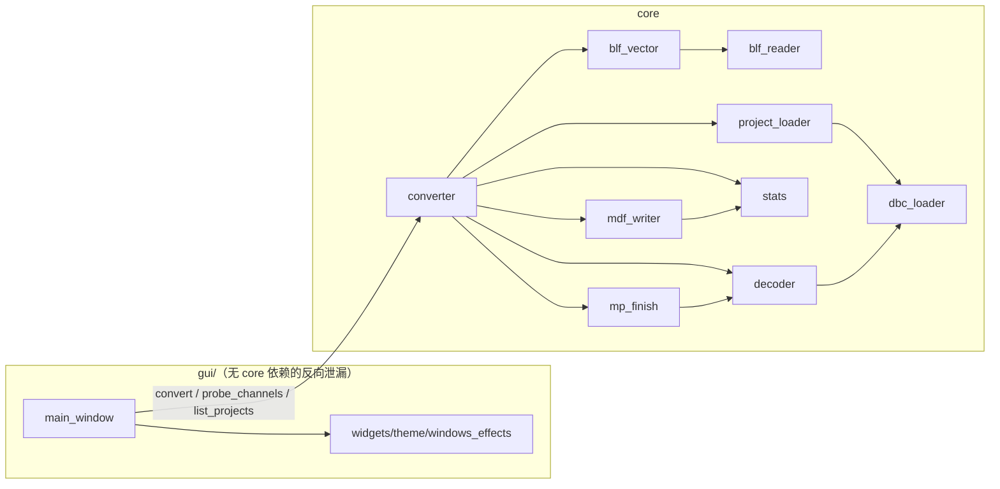

# BLF→MDF 代码架构合理性审查

日期：2026-08-18　|　审查范围：core/（9 模块）、gui/（5 模块）、main.py、tests/（17 文件）、tools/（21 脚本）、blf2mdf.spec　|　分支：arc（92e02b0）

## 0. 摘要

生产代码（core/ + gui/）架构**健康，无高严重度问题**；两处「高」级问题集中在验收工具链（tools/ 对拍脚本），它恰恰是保护本项目最独特资产——与 CANoe 逐位一致对拍链——的环节，而该环节自身没有测试保护。

审查标准为用户明示的六条：① 架构干净 ② 调用链扁平 ③ 契约明确 ④ 严格收口 ⑤ 易于人类理解维护 ⑥ 无真实必要性不新增抽象和层级。整体上 ①② 达标良好（主链路 6 跳且每层有真实行为；依赖单向无环；GUI↔core seam 干净）；主要偏差集中在 **④ 严格收口**——归一化键、半成品清理、进度带计划、绑定匹配契约等跨模块规则各有多份独立实现；以及 ③ 的部分——桶 dict 三态隐式多态契约。测试体系的 seam 质量两极分化：test_converter 是契约测试标杆，test_gui_binding/test_gui_style 则打在 widget 对象图与实现文本上。

按词汇表表述：core 的深模块（位提取、单遍路由、窗界聚合、ContainerFrames 双契约）分布健康，但三个**真实接缝**（解码桶、绑定匹配、对拍逻辑）的接口仍是隐式多态 dict / 格式化字符串 / 不可 import 的 CLI 函数——接缝真实存在而契约没有显式成型。

---

## 1. 审查范围与标准

| 维度 | 内容 |
|---|---|
| 标准 | 用户明示六条：架构干净、调用链扁平、契约明确、严格收口、易理解维护、不新增无谓抽象 |
| 词汇 | module / interface / implementation / depth（深/浅模块）/ seam / adapter / leverage / locality；deletion test；「interface 是测试面」；「一个 adapter = 假设接缝，两个 = 真实接缝」 |
| 方法 | 4 个并行分区审查代理全文通读（core 管线 / core 读写侧 / GUI 与入口 / 测试与工具链），每项论断附 文件:行号 证据；关键论断经第二遍交叉核验 |
| 硬前提 | 输出与 CANoe 逐位一致 + 性能基线（[master plan](../func_impro/2026-08-15-blf-mdf-conversion-master-plan.md)）不可牺牲；架构判断不因性能注释放水，重构建议不破坏已验证优化 |
| 热度依据 | 近 60 次提交改动频率：tests 65 / core 61 / docs 48 / gui 25 / tools 23 |

分区报告已交叉比对，重叠发现已合并（.mf4 清理、`_find_ccu3_root` 错位等由两个分区独立发现）。

## 2. 现状架构总览

### 2.1 模块地图

| 文件 | 行数 | 职责 | 公开接口（一句话契约） |
|---|---|---|---|
| core/blf_reader.py | 454 | BLF 标量解析（oracle）+ 探测 | `Frame`、`probe_channels`、`read_start_time`、`list_channels`、`iter_messages`、`ScanCancelled`（全项目取消异常唯一定义点） |
| core/blf_vector.py | 456 | H1 向量化快路径 + 回退编排 | `ContainerFrames`（packed/scattered 双契约）、`iter_container_frames`（快路径失败回退标量，决策唯一收口点） |
| core/converter.py | 536 | 转换编排 | `convert()`、`ConversionResult`、`ChannelSummary`；私有 `_read_vectorized`（单遍扫描路由） |
| core/decoder.py | 453 | 帧→信号物理值 | `SignalSeries`、`DecodeStats`、`ChannelDecoder`、`decode_channel`（测试面包装） |
| core/mp_finish.py | 279 | 并行 per-bucket finish | `make_pool`、`bucket_bytes`、`finish_all`（结果与串行 finish 同形） |
| core/stats.py | 154 | CANoe 1s 统计语义 | `STAT_NAMES`/`STAT_CHANNELS`、`aggregate_channel`（deep）、`align_timestamps`（时间网格规则唯一实现）、`ChannelStats` |
| core/mdf_writer.py | 130 | MDF 4.10 写出 adapter | `RawGroup`、`write_mdf`；import 时改 asammdf 全局压缩级别 |
| core/dbc_loader.py | 108 | DBC 域模型 | `SignalDef`/`MessageDef`/`DbcDef`（messages 键归一化构造单点）、`load` |
| core/project_loader.py | 125 | ccu3.0 项目载入/匹配 | `DEFAULT_MAPPING`、`list_projects`、`load_mapping`、`load_project`、`auto_bindings` |
| gui/main_window.py | 981 | 主窗口 + 转换编排 + 状态管理 | `MainWindow`、`ConvertWorker`/`BlfScanWorker`（QThread adapter）、`_find_ccu3_root` |
| gui/widgets.py | 421 | 无业务 PySide 展示组件（零 core 依赖） | `AppShell`、`CompactCombo`、`DbcListWidget`、`TitleBar`、`SummaryDialog` 等 |
| gui/theme.py | 266 | 视觉令牌与 QSS | `WINDOW_WIDTH/HEIGHT`、`APP_QSS`、`apply_theme` |
| gui/windows_effects.py | 70 | Win11 玻璃/圆角 + 软件回退 | `apply_light_glass`、`sync_rounded_window` |
| gui/resources.py | 26 | 运行时路径与图标 | `resource_path`、`install_application_icon` |
| main.py | 27 | 程序入口 | `main()`；`freeze_support()` 铁律 |
| tests/ | ~4400 | 17 文件 | 见 §5.4 |
| tools/ | ~1700 | 21 脚本 | 见 §5.4（8 个可删、3 个合并） |

### 2.2 依赖方向与主链路



依赖单向无环；blf_vector 单向依赖 blf_reader 的 4 个私有名（`_iter_containers`/`_walk_container`/`_ms_part_ns`/`ScanCancelled`）——快路径依赖 oracle，方向正确。

主转换链路（convert → 位提取共 6 跳，**每层有真实行为，无纯转发层**）：

```
ConvertWorker.run
 └─ convert ─ read_start_time
     ├─ _read_vectorized ─ iter_container_frames ─ _parse_fast（快）| _walk_container（回退=oracle）
     │     └─ _bucket_block → 写入 dec.buckets → _assemble_bucket
     ├─ 串行: dec.finish ─ _normalize_bucket ─ _finish_bucket_vectorized ─ _extract_signal ─ _extract_bits
     ├─ 并行: mp_finish.finish_all ─ _finish_bucket_worker ─（同一对桶函数，非复制语义）
     ├─ 统计: aggregate_channel × 16 ─ align_timestamps
     └─ 写出: write_mdf ─ asammdf append/save + os.replace
```

---

## 3. 问题清单（跨模块合并，按严重度）

### 高（2 项，均在验收工具链）

**H1. 对拍 oracle 不可 import、自身无测试保护**
- 位置：[tools/compare_two_mdf.py:19-20](../../tools/compare_two_mdf.py#L19-L20)（`main()` 内直接 `MDF(sys.argv[1])`）；[tests/test_parallel_decode.py:216-245](../../tests/test_parallel_decode.py#L216-L245)（第 3 份 `_mdf_equal` 拷贝）
- 违反：③ 契约明确、⑤ 易维护
- 证据：对拍链是项目验收的根基（master plan §8 点名 compare_two_mdf + full_compare），但对比逻辑无法被 import，测试只能复制；oracle 自身没有任何 pytest 保护——oracle 出错则整条对拍链静默失真。
- 方向：对比逻辑提为可导入函数，工具与测试共用同一实现，CLI 只做参数解析，并补 oracle 自身的回归测试。

**H2. tools/ 对拍脚本族 7 个各自重实现同一逻辑，能力散落三处**
- 位置：compare_mdf / compare_mdf_v2 / compare_mdf_deep / deep_compare_mdf / deep_compare_latest / compare_two_mdf / full_compare
- 违反：④ 严格收口、② 扁平
- 证据：每个脚本独立重写「加载两组、按名对齐、逐点比较」；头部对比（compare_mdf_v2.py:35-39、compare_mdf_deep.py:48-56）与统计 t 轴细查（deep_compare_latest.py:69-83）是独有能力，必须合并而非纯删；deep_compare_mdf.py docstring 自称「对比两个 MDF」而 main 只读 sys.argv[1]（变质残留）。
- 方向：收口为两个保留工具（自产对拍 + CANoe 报告），其余删除。

### 中（8 项）

**M1. 解码桶契约三态隐式多态 + 分类逻辑双实现**
- 位置：桶三形态——feed 列表形（[decoder.py:412](../../core/decoder.py#L412) 注释只写这一种）、blocks 块形（[converter.py:169-177](../../core/converter.py#L169-L177) 写入）、数组形（[converter.py:79-103](../../core/converter.py#L79-L103) 装配）；形状分派靠 isinstance 散布 [decoder.py:156](../../core/decoder.py#L156)、[mp_finish.py:91](../../core/mp_finish.py#L91)；「未知 ID/短帧 → 未知不入桶」分类不变量在 feed（decoder.py:417-428）与向量化路由（[converter.py:140-157](../../core/converter.py#L140-L157)）各实现一遍，等价性靠注释声明 + 测试锁定而非结构保证
- 违反：③ 契约明确、④ 收口、⑤
- 证据：不变量（arb=归一化键、raw_id=首帧原始 id、插入序=系列序）只在各自 docstring 片段陈述，无集中声明；[converter.py:389](../../core/converter.py#L389) 的 `not isinstance(t[0], np.ndarray)` 是形状多态的死残留。
- 方向：桶结构收口到单一 owner，三态收敛为显式状态或单一产物；分类规则单实现（此改动触及性能前提——单遍扫描三方收集，需评估后动）。

**M2. 归一化键规则三处独立实现，无单一归属点**
- 位置：[dbc_loader.py:77](../../core/dbc_loader.py#L77)、[decoder.py:417](../../core/decoder.py#L417)、[converter.py:120-121](../../core/converter.py#L120-L121) 各自写出 `arb | (0x80000000 if is_ext else 0)`
- 违反：③ 契约明确、④ 收口
- 证据：[converter.py:28](../../core/converter.py#L28) docstring 承认「与 dbc.messages 键契约一致」——契约靠注释转发而非引用；改键规则（如 FD 专属 ID 空间）需同改 3 模块。
- 方向：归一化收敛为一个归属点，三处改为调用。

**M3. 半成品 .mf4 清理收口分裂：命名知识泄漏 + 清理双份**
- 位置：[mdf_writer.py:129-130](../../core/mdf_writer.py#L129-L130)（save 写 `<out>.mf4` 再 `os.replace`）；[converter.py:511-517](../../core/converter.py#L511-L517) 与 [519-523](../../core/converter.py#L519-L523) 两份硬编码 `<out>.mf4` 清理
- 违反：④ 收口
- 证据：converter 复述 writer 的中间文件命名（deletion test：writer 改临时文件策略则 converter 清理静默失效）；writer 自身失败时不清理——任何其他调用方直接调 write_mdf 都会留残留。
- 方向：「失败无残留」成为 write_mdf 自身契约（内部 try/清理），converter 仅保留取消语义分支。

**M4. 绑定匹配契约以「显示名字符串」跨三模块，且决策算法嵌在表格操作里**
- 位置：display_name 定义 [dbc_loader.py:41-48](../../core/dbc_loader.py#L41-L48)；auto_bindings 返回 {通道: 显示名}（[project_loader.py:112-125](../../core/project_loader.py#L112-L125)，docstring 明说「匹配直接以显示名比对」）；GUI 端 [main_window.py:616-622](../../gui/main_window.py#L616-L622)（combo 文本 in valid）、:811-820（`_dbc_by_display` 逐项文本比对）；决策算法 `_rebuild_channel_table`（:575-633）含双键型契约（auto 键 int、prev 键 "CANn" 字符串，注释明言不可混用）
- 违反：③ 契约明确、⑤
- 证据：绑定链路 key 是格式化字符串（`PFCAN1.dbc（A19G1）`），display_name 格式一变绑定静默断裂，仅 [test_gui_binding.py:110-113](../../tests/test_gui_binding.py#L110-L113) 兜底；该文件 docstring（:1-5）记载键型 bug 真实事故史。
- 方向：匹配键改结构化身份（显示名只作展示）；「(channels, prev, auto_bind, 有效 DBC 名) → 每行选择+状态」决策抽为无 Qt 纯函数，窗口方法退化为渲染。

**M5. 进度百分比带计划散布三模块**
- 位置：解码 10→90 在 [converter.py:424-425](../../core/converter.py#L424-L425)（串行）与 [mp_finish.py:191-194](../../core/mp_finish.py#L191-L194)（并行）各自写死；读取 5→10、统计 92→95 另在 converter 两处
- 违反：④ 收口
- 证据：任一方改带即破坏「单调不降」不变量（test_converter.py:140-141、test_parallel_decode.py:124-125 锁行为但未锁「计划属于谁」）。
- 方向：带计划收口为单一决策点（常量/函数共享），勿引入「进度管理器」抽象（标准 ⑥）。

**M6. mdf_writer import 即改 asammdf 全局状态**
- 位置：[mdf_writer.py:17-18](../../core/mdf_writer.py#L17-L18)
- 违反：① 架构干净、③
- 证据：`_v4_blocks.COMPRESSION_LEVEL = 9` 在 import 时执行——副作用不体现在 write_mdf 接口上，import 顺序敏感。注释已交代 asammdf save 不暴露该参数的硬约束。
- 方向：副作用至少进模块 docstring 显式声明（受限作用域的既定事实），或集中到显式初始化点。

**M7. GUI 测试打 widget 对象图 / 私有方法 / 实现文本**
- 位置：[test_gui_binding.py](../../tests/test_gui_binding.py) 35 处 `cellWidget(...).currentText()`/`table.item(...).text()`/私有方法直调（如 :36-42）；[test_gui_style.py:42](../../tests/test_gui_style.py#L42) 断言 QSS 源码字符串（换行缩进敏感）、:580 像素色值、:176-178 精确尺寸
- 违反：③、⑤（「interface 是测试面」原则——测试穿透接口打实现）
- 证据：任何表控件重构（QTableWidget→QTableView+model）一次性打碎 test_gui_binding 全文件；QSS 重构需逐字符改测试。视觉定稿锁有真实价值（唯一自动化的视觉契约守护），但断言对象应是渲染结果/结构而非文本格式。
- 方向：表格状态查询/驱动收敛为 MainWindow 上少量稳定方法面；QSS 断言放宽为结构断言（选择器/属性存在性）。

**M8. tests ↔ tools 双向依赖 + 绑定表知识三份**
- 位置：bench 脚本 `sys.path.insert(0, .../tests)` 反向依赖（bench_bucket_dist.py:14-16、bench_parallel_finish.py:26-28、bench_stages.py:12-14）；test_package_config.py:43,49 反向 import tools；通道↔DBC 绑定表三处（test_golden.py:16-27 BINDING / convert_aht.py:15-26 硬编码 / project_loader.DEFAULT_MAPPING）
- 违反：②、④
- 方向：绑定表与样例路径收敛到单一中性来源；tools 不 import tests。

### 低（12 项，择要）

| # | 位置 | 问题 | 违反 |
|---|---|---|---|
| L1 | [mp_finish.py:74-76](../../core/mp_finish.py#L74-L76) vs :157-158 | worker 数决策双实现（env 覆盖仅 converter 路径生效）；`decoders`/`channels` 双真值源无防御 | ④ |
| L2 | [stats.py:154](../../core/stats.py#L154) | `ChannelStats(channel=0)` 硬编码死字段，mdf_writer 从不读它——通道身份靠「converter 按 STAT_CHANNELS 顺序 append」的未成文不变量 | ③ |
| L3 | [mp_finish.py:63](../../core/mp_finish.py#L63) | warm_up 依赖 `pool._max_workers` stdlib 私有属性，make_pool 已知 n 却不传 | ⑤ |
| L4 | [converter.py:484/493](../../core/converter.py#L484) | 同一「无统计数据」缺省两种元组形状 `((), None, None, None)` vs `((), (), (), ())` | ⑤ |
| L5 | [mp_finish.py:48-49](../../core/mp_finish.py#L48-L49) | `_finish_bucket_worker` 6 元组位置契约，两处解包靠位置记忆，前两元素被丢弃 | ③ |
| L6 | [converter.py:106-107](../../core/converter.py#L106-L107) | `_read_vectorized` 10 个位置参数 + 写 4 个可变结构——全管线最 deep 的函数，接口是裸结构集合（当前仅 1 调用方，暂不必动） | ③⑤ |
| L7 | [converter.py:368-372](../../core/converter.py#L368-L372) | make_pool 失败静默吞掉，用户无从得知本次串行还是并行 | ⑤ |
| L8 | [blf_reader.py:159-170](../../core/blf_reader.py#L159-L170) | read_start_time 走 float 中转两次，而模块内已有 `_systemtime_ns` 纯整数路径（float 路径有 ±119ns 安全论证，属已知冗余） | ①⑤ |
| L9 | [blf_reader.py:432-454](../../core/blf_reader.py#L432-L454) | `scan_channels` 零调用者、零测试引用；且 H1 计划文档（docs/func_impro/2026-08-14-H1-vectorized-parse-plan.md:21）声称它是「对拍参考与测试覆盖对象」——**文档漂移**，事实无测试引用。deletion test：直接删，复杂度不转移 | ⑥ |
| L10 | blf_reader.py:151-155 / 381-390 / blf_vector.py:437-446 | 尾部衔接 + ms_part 推导骨架三份复制 | ⑥ |
| L11 | [main_window.py:656-657](../../gui/main_window.py#L656-L657)、:751-753、:651-654 | `_fit_table_width` 空方法零调用；`_remove_dbc` 零调用（仅 :685 用 `_remove_dbc_at`）；`_fit_window_height` 近 no-op | ⑤ |
| L12 | 其余命名/住所类：ScanCancelled 定义在 blf_reader 却同时是 convert 的取消信号（[blf_reader.py:16](../../core/blf_reader.py#L16)）；关窗确认文案与取消语义矛盾（[main_window.py:970-977](../../gui/main_window.py#L970-L977)）；DbcCombo 定义在 main_window 与 widgets.py 自述冲突；conftest 无 fixture 且 import 时 mkdir；test_parallel_decode 鸭子类型伪造 Frame；test_main_entry 按函数名断言 AST | ③⑤ |

---

## 4. 深化候选

> 词汇：**深模块** = 小接口 + 大实现（leverage/locality）；**浅模块** = 接口近于实现。按「一个 adapter = 假设接缝，两个 = 真实接缝」判定哪些接缝值得显式成型。

| 候选 | 强度 | 说明 |
|---|---|---|
| A. 桶记录类型化 + owner 集中（M1） | **Strong** | 桶已有两个生产者（feed 列表、向量化 blocks）+ 一个归一化 adapter——接缝真实，但接口是隐式多态 dict。类型化不增层级、只浓缩契约 |
| B. 绑定决策抽无 Qt 纯函数（M4） | **Strong** | 全 GUI 分区唯一真正的算法，有已发生 bug 史；当前测试面必须穿越 Qt。抽纯后测试成本骤降、981 行主类直接缩短 |
| C. 归一化键单一来源（M2） | **Strong** | 三处调用点收敛一处，改动小、无争议 |
| D. write_mdf 失败无残留归 writer（M3） | **Strong** | 直接落实「严格收口」；converter 两个清理分支随之简化 |
| E. ContainerFrames → 帧序列转换 adapter | **Strong** | test_blf_vector 手工重建帧语义（`_payload`+`_assert_eq`），H7b 一次表示变更迫使 7 处测试更新（master plan 已实证该成本）。adapter 同时简化 converter 与测试两侧 |
| F. 对拍逻辑收口为可导入模块并纳入 pytest（H1/H2） | **Strong** | 修复两个「高」级问题；对拍 oracle 获得测试保护；tools 目录 21→6~7 个 |
| G. ChannelStats 通道身份显式化或删死字段（L2） | **Strong** | 消除「顺序即通道」隐式不变量，纯减复杂度；deletion test：无人读它，删之复杂度不转移 |
| 视觉令牌收敛或双轨明示（GUI P2） | Worth exploring | 同一色值 #207e4b 出现在 theme.py:42 / widgets.py:169 / main_window.py:670 三处；若团队实际迭代方式是就地改色，双轨明示比强制收敛诚实 |
| 统一两个 worker adapter 骨架（GUI P3） | Worth exploring | 两个 adapter 证明 seam 真实；骨架同构是已兑现成本；合并是否更可读需拿一版对照再定 |
| worker 数 / 进度带单一来源（L1/M5） | Worth exploring | 收口方式为最小常量/函数共享，不引入「进度管理器」抽象 |
| test_gui_binding 表格状态查询收敛（M7） | Worth exploring | 约 35 处 widget 图访问收到 2-3 个方法面 |
| `_find_ccu3_root` 下沉 project_loader（读写侧 P5） | Worth exploring | 模块自述职责与实现分离；测试跨包归属暴露错位，locality 直接改善 |
| 容器流衔接骨架三份收敛（L10） | Worth exploring | 收敛后 blf_vector 对 blf_reader 的 4 个私有名依赖可降为正式接口 |
| read_start_time 整数化（L8） | Worth exploring | 方向明确，当前 float 路径有安全论证，非急需 |
| conftest 上收 fixture + sample_blf 显式化；冻结探针转 subprocess pytest | Worth exploring | 消除两份 GUI fixture 重复与「第一个 BLF」漂移；进程级行为进测试体系 |
| 并行退化显式化（L7）/ 取消协议中性化（L12） | Speculative | 可观测性与命名洁癖，成本极低可搭车 |
| DEFAULT_MAPPING 从数据文件自动生成 | Speculative | 消除手工同步副本，但引入构建/缓存机制，成本可能高于收益 |
| 解码路由回归 decoder 模块 ownership | Speculative | 分类单实现收益真实，但单遍三方收集是性能前提，拆开需回调接口，可能违背标准 ⑥；现有测试锁足以兜底，不必现在动手 |
| MainWindow 拆窗口/控制器/模型 | **明确否决** | deletion test：981 行中约 300 行是声明式 QWidget 构建，拆开是把同一复杂度摊到更多文件 + 新增跨文件事件布线，违反标准 ⑥。实际深度在 `_rebuild_channel_table`，已由候选 B 覆盖 |

---

## 5. 首要建议

**先做 F（对拍工具收口 + 入 pytest），随后按 D → C → G → B → A 的顺序推进。**

理由：
1. F 是唯一同时修复两个「高」级问题的候选，且**与生产代码零接触**——不触碰性能前提与逐位一致对拍链，风险最低、回报是保护项目最独特的资产（对拍链自身获得验收）；
2. F 自带「减法」：tools/ 21 个脚本中 8 个可直接删（bench_bucket_dist / bench_parallel_finish / bench_spawn / bench_probe / probe_blf / convert_aht / run_gui_probe / verify_clean_env / compare_mdf / deep_compare_mdf），3 个合并后删（compare_mdf_v2 / compare_mdf_deep / deep_compare_latest），最终收口约 6~7 个——符合「先做减法再谈抽象」；
3. D/C/G 是低风险小改动的纯收口，逐项独立可回退，符合「任一验收失败即停」的项目纪律；
4. B、A 涉及生产代码与 GUI 测试面，是真正的深化项目，放在收口类小改之后单独排期。

---

## 6. 已符合标准的资产（审查建议不得破坏）

1. **并行/串行语义等价锚定在单一契约**：worker 复用同一实现函数而非 fork 解码逻辑（[mp_finish.py:43-47](../../core/mp_finish.py#L43-L47)）；`verify=True` 把对拍做进生产接口——「interface 是测试面」正面教材。
2. **「回退即 oracle」三层机制**：快路径字段权威声明（blf_vector.py:12-15）+ 对拍测试「标量正常而快路径抛异常 = 违约」（test_blf_vector.py:141-164）+ fuzz 对拍（:464-517）；守卫/回退决策单点收口（blf_vector.py:447-456）。双实现是受控设计决策，不是失控重复。
3. **GUI↔core seam 形状干净**：core 全同步、零 Qt；跨 seam 仅两个单向回调（progress_cb 出、cancel_cb 入）；产品决策（raw_export=False、parallel=True）单点集中在 ConvertWorker；三条取消入口（扫描按钮/转换按钮/closeEvent）全部汇到 `threading.Event.set()` 一个咽喉。
4. **时间戳整数构造主题贯穿**：blf_reader docstring → blf_vector 守卫分判 → mdf_writer `_abs_time_ns` 纯整数写出，浮点舍入论证全程可追溯，测试锁定逐位一致。
5. **stats.py 模块 docstring 即 CANoe 语义规格**；`align_timestamps` 作为时间网格规则唯一实现被两处复用——正确的 leverage 与 locality。
6. **test_converter.py 是 seam 质量标杆**：只经 `convert()` 公共接口 + asammdf 读回断言，唯一 monkeypatch 打在 adapter 接缝；test_blf_reader 的 `_raw_rel_ns` 用 python-can struct 独立重解析（零共享代码的双实现对拍）；双 oracle 模式（test_stats / test_decoder_vectorized 保留优化前慢参考）leverage 极高。
7. **性能注释不遮架构判断**：每处向量化均标注「与参考逐位一致 + 测试名/实测数据」，性能理由以数据陈述而非借口。

---

## 7. 附录：方法局限与后续

- 本次为静态架构审查，未做运行时剖析；审查结论不与任何性能数据冲突（性能硬前提已声明）。
- 未逐行比对 docs/superpowers 下的 12 份设计/计划文档与代码现状（仅抽查 master plan 一处发现 L9 文档漂移）。
- 审查不修改任何代码；所有问题条目均含 文件:行号 证据，可按条目逐一复核。

**下一步**（按 improve-codebase-architecture 流程）：以上候选只描述问题与方向、未设计接口。你想先探索哪一个？选定后进入逐项 grill（约束、依赖、深化后模块的形状、哪些测试存续）。
